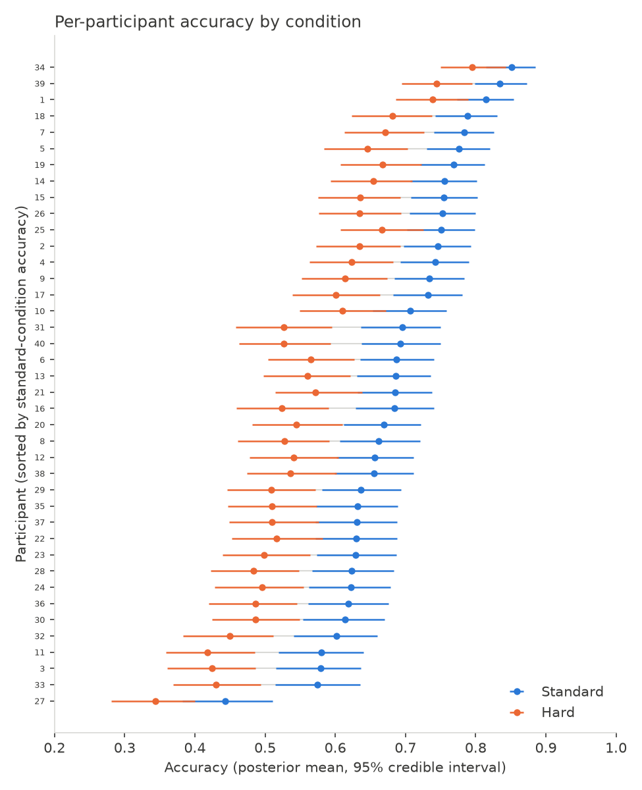
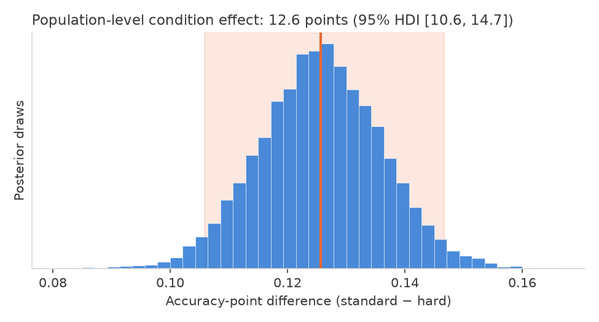

# Accuracy by condition — lab meeting summary

**Data:** 40 participants, 5 sessions each, 100 trials/session/condition, "standard" vs.
"hard" (`data/sessions.csv`, `data/trials.csv`). Trial-level and session-level counts match
exactly (400/400 rows, no discrepancies).

## Bottom line

Accuracy is reliably lower in the hard condition. Averaged over participants, accuracy is
about **69% in standard** (95% credible interval: 66–72%) vs. **57% in hard** (95% CI:
53–60%) — a difference of about **12.6 accuracy points** (95% CI: 10.6–14.7). The data are
essentially decisive on direction: every posterior draw for the condition effect favors
standard over hard, and the same holds participant-by-participant — all 40 participants
individually show higher standard-condition accuracy with better than 95% posterior
probability.

## How this was computed

Because each participant contributes 5 repeated sessions per condition, and because session
scores for the same participant/condition don't fluctuate like pure coin flips (their
variance is on average about 2.6x higher than binomial sampling alone would predict — some
sessions are just off days), a plain accuracy-plus-Wilson-interval per participant would
understate the true uncertainty. Instead I fit a Bayesian hierarchical logistic regression:
each participant has their own baseline accuracy and their own condition effect
(partially pooled across participants, so noisy individuals borrow strength from the group),
plus a session-level noise term that absorbs the extra-binomial variability. This gives
per-participant accuracy estimates that are shrunk appropriately and credible intervals that
reflect the real session-to-session noise, not just optimistic binomial counting.

The model converged cleanly (no divergences, R-hat ≤ 1.01, adequate effective sample size)
and reproduces the observed distribution of scores well in posterior-predictive checks.
Calibration checks (PIT/coverage) show mild, localized miscalibration — not enough to affect
the conclusion above, but a reason to treat the *exact* per-participant interval widths as
approximate rather than exact. The condition effect is robust to prior choice: refitting with
much wider priors on all variance components changed the estimated effect by less than 0.2%.

## Figure 1 — per-participant accuracy by condition

Each row is one participant (posterior mean accuracy, 95% credible interval), sorted by
standard-condition accuracy. Blue = standard, orange = hard. The consistent leftward shift
from blue to orange, participant after participant, is the headline result: this isn't a
few outliers dragging an average down, it's essentially everyone. Full per-participant
numbers are in `accuracy-hierarchical/participant_accuracy.csv`.

## Figure 2 — how big is the condition effect, and how sure are we?

This is the posterior distribution of the population-average accuracy gap between
conditions. The shaded band is the 95% credible interval; it sits entirely above zero,
comfortably clear of no-effect.

## Caveats

- This is an observational comparison of two conditions within the same session design —
  it does not by itself rule out order/fatigue effects if condition order wasn't
  counterbalanced (I didn't have that information in the codebook).
- Calibration diagnostics flagged mild, localized miscalibration; the qualitative
  conclusion (hard < standard, for essentially everyone) is far too large relative to this
  to be an artifact of it, but treat individual interval bounds as approximate.
- Full technical detail (priors, diagnostics, calibration plots, prior-sensitivity check)
  is saved under `accuracy-hierarchical/` for anyone who wants to dig in:
  `inference_data.nc`, `diagnostics.json`, `calibration.json`, `summary.csv`,
  `participant_accuracy.csv`, `population_effect.json`.
