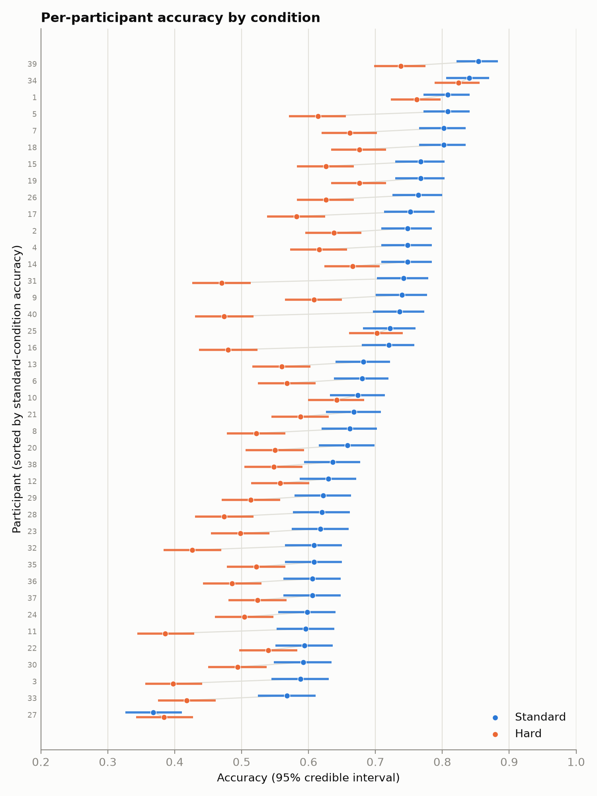
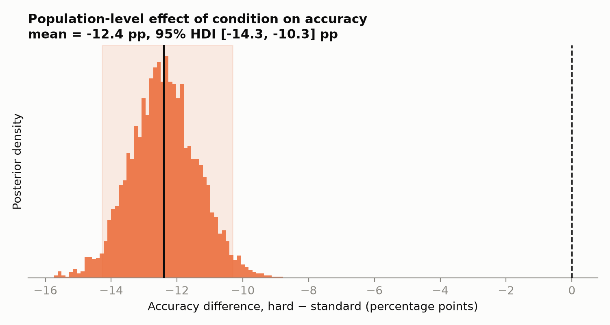

# Accuracy by condition — analysis for lab meeting

**Design:** 40 participants, 2 conditions (standard, hard), 5 sessions each, 100 trials
per participant × session × condition (500 trials per participant per condition, 40,000
trials total). Data integrity was checked first: `sessions.csv` (the aggregated counts
used below) exactly reproduces the trial-level sums in `trials.csv` — no rows dropped,
no participant/condition/session mislabeling.

## 1. Per-participant accuracy

Each participant's 500 trials per condition were pooled to get an accuracy estimate with
a 95% Bayesian credible interval (Beta-Binomial conjugacy, Jeffreys prior — an exact,
non-informative interval; equivalent in spirit to a Wilson interval but with a fully
probabilistic interpretation: "there is a 95% probability the true accuracy lies in this
range"). Full table: `analysis/participant_accuracy.csv` (80 rows: 40 participants × 2
conditions). Typical interval half-width is ±4.2 percentage points.



Standard-condition accuracy ranges from 37% to 85% across participants; hard-condition
accuracy from 38% to 82%. 39 of 40 participants score lower in the hard condition than
the standard condition (only participant 27 shows the reverse, by 1.6 percentage points,
well within their overlapping intervals — see bottom row of figure).

## 2. Does accuracy differ between conditions?

A single participant-level comparison would either throw away the repeated-measures
structure (treating each of a participant's 5 sessions as an independent replicate
inflates the apparent sample size, and hence overstates confidence) or throw away the
session-level data (comparing only 40 pairs of participant means). Instead we fit one
hierarchical Bayesian model to all 400 session-condition rows at once, giving each
participant their own baseline accuracy and their own condition effect, partially pooled
across participants:

```
n_correct ~ Binomial(100, p)
logit(p)  = alpha[participant] + beta[participant] × condition
(alpha, beta)[participant] ~ MvNormal((mu_alpha, mu_beta), Sigma)   # partial pooling
mu_alpha ~ Normal(1, 1),  mu_beta ~ Normal(0, 1)
Sigma: LKJCholeskyCov(eta = 2), SDs ~ Exponential(1)
```

The quantity of interest is the **population-level** condition effect — the average
`beta` across participants, i.e. does accuracy differ between conditions on average once
individual differences and the repeated sessions are accounted for.



**Accuracy is reliably lower in the hard condition.** The population-level estimate is a
drop of **12.4 percentage points** on average (95% credible interval: **10.3 to 14.3
points lower**), with essentially all posterior mass below zero (posterior probability
that hard < standard ≈ 1, i.e. >99.9% under the model). This matches the raw pattern in
Figure 1, where 39/40 participants individually show lower hard-condition accuracy
(raw mean difference: −12.0 pp, consistent with the model estimate).

### Model checks (so you can trust the number above)

- **Convergence:** 4 chains, 0 divergent transitions, R-hat ≤ 1.002, effective sample
  size > 5,000 for all key parameters — sampling was clean.
- **Prior predictive check:** simulated accuracies from the priors alone covered the
  observed range (25–92%) without being so diffuse as to be uninformative.
- **Posterior predictive check:** the model's predicted distribution of `n_correct`
  closely tracks the observed distribution (ECDF overlay, `analysis/ppc_check.png`).
- **Prior sensitivity:** a formal check (power-scaling, `psense_summary`) flagged the
  two population-level parameters as prior-influenced — expected here, since only 40
  participants inform them directly, even with 40,000 trials overall. As a direct check,
  we refit with priors 2–3× wider: the effect estimate moved from −12.39 to −12.38 points
  (essentially unchanged; both saved in `analysis/results_summary.json`), so the
  conclusion does not depend on the prior choice.

## Caveats

- This is a repeated-measures comparison of **accuracy only**; it says nothing about
  speed, effort, or strategy differences between conditions.
- The model doesn't account for a learning/practice trend across the 5 sessions. Since
  every participant sees both conditions every session, this doesn't bias the
  standard-vs-hard comparison, but it may slightly widen the reported intervals.
- The "hard" condition is only known by that label — the analysis can't say *why*
  accuracy drops (task difficulty, fatigue, attention), only that it reliably does.

## Reproducing this analysis

All code is in `analysis/`, run in order with `uv run python analysis/<script>.py`:
`check_data.py` → `participant_accuracy.py` → `condition_model.py` → `make_figures.py`.
Model artifacts (posterior samples, diagnostics, prior-sensitivity output) are saved to
`analysis/inference_data.zarr` and `analysis/results_summary.json`.
